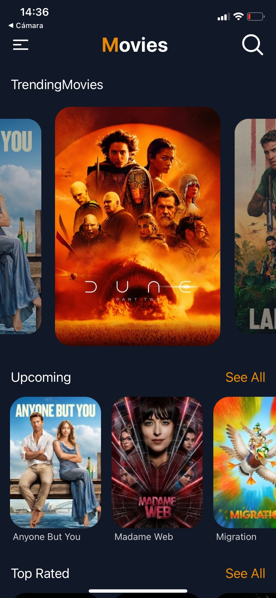
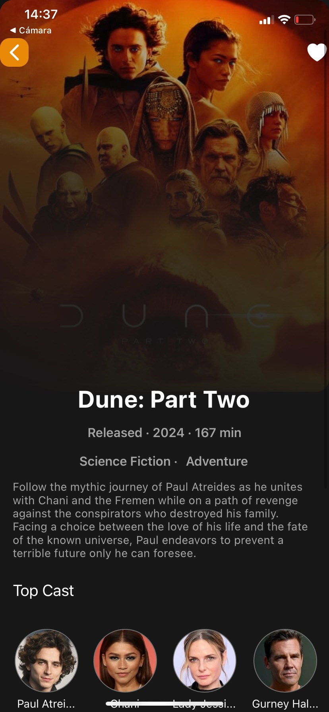
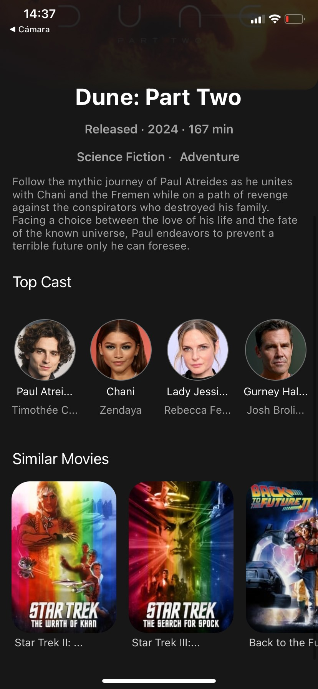
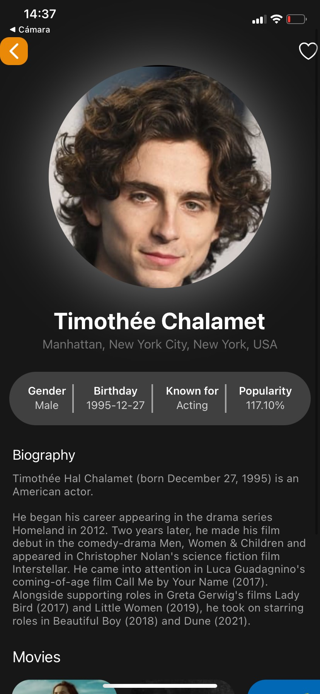
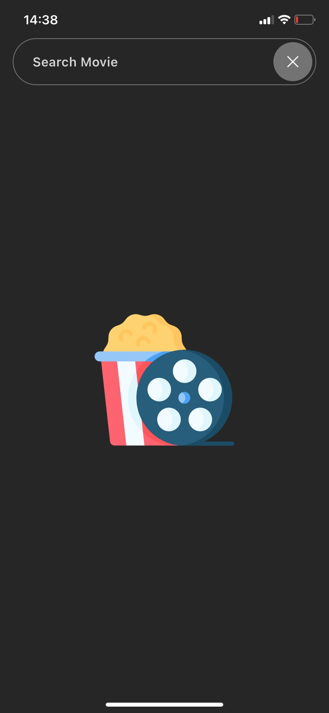
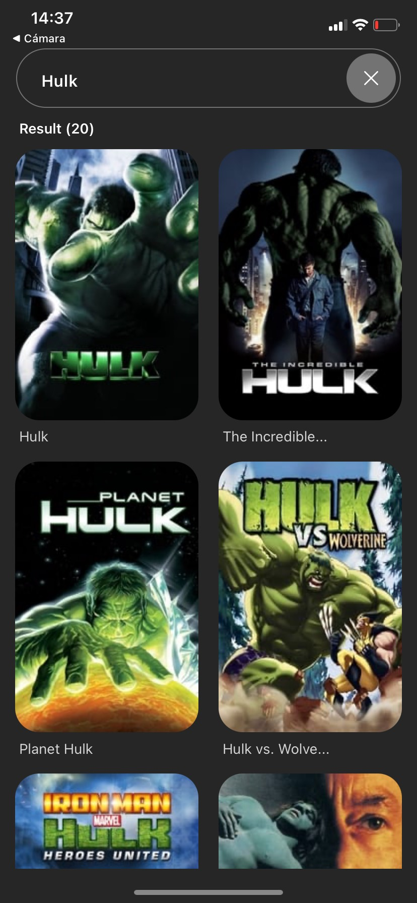

# Movie App
This movie app is a platform that utilizes The Movie DB API to offer users access to a wide selection of movies and actors. Developed with React Native, Expo, NativeWind, and React Navigation, the app provides a user-friendly and easy-to-use interface for movie enthusiasts.

## Demo
<div>
  <div>
  
  
  
</div>
<div>
  
  
  
</div>


## Features
### Explore Current Movies
* Browse through a list of popular and current movies.
* Filter movies by categories such as comedy, drama, action, etc.

### View Movie Details
* Tap on a movie to view more details, such as the release date, synopsis, director, and cast.
* See similar movies to the one selected.

### Actor Details
* Tap on an actor to view more information about them, such as their biography, filmography, and awards.

### Additional Features
* Search for movies by title or actor name.
* Save favorite movies to a personal watchlist.

## Technologies Used
* React Native
* Expo
* NativeWind
* React Navigation

## Installation

1. Clone the repository
```
git clone https://github.com/AGuardiola20/movies-app-react-native.git
```
2. Navigate to the application directory
```
cd movies-app-react-native
```

3. Install dependencies
```
npm install
```

4. Run the app
```
npx expo start
```

